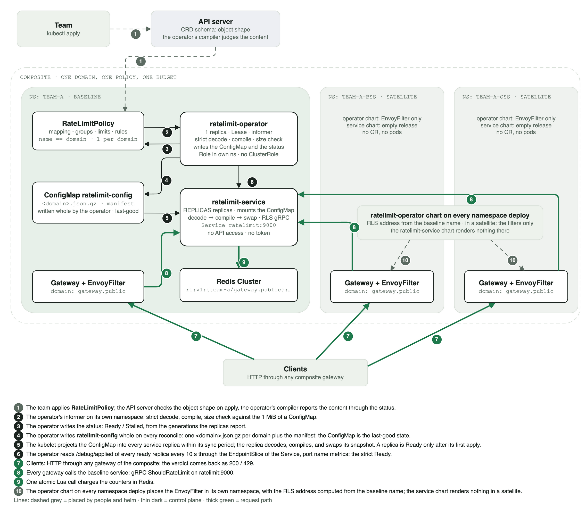

# Interaction diagram: operator, service, policy, baseline, and satellites

A visual version of the [topology](deployment-topology.md) for the composite scheme: the team places the domain
policy in the baseline, the API server checks the object's shape, and the operator in the baseline reads the
object, compiles it, and writes it into the ConfigMap `ratelimit-config`; the service in the baseline executes it for
the gateways of all namespaces in the composite, with one domain and one budget.

Arrow styles: dashed for what people and helm place; thin for the control plane (the informer, the status, the
ConfigMap, the probe of the replicas); thick for the data plane, the request path. The numbers on the arrows are
explained under the picture.

Requests from the baseline and from satellites are indistinguishable: the same domain and descriptors lead them into
the same buckets of the baseline service, the composite's shared budget. The operator sees only its own namespace:
a policy placed in a satellite is processed by nobody.

## What goes where and who processes it

| Object | Who places it | Where | Who processes it |
| --- | --- | --- | --- |
| `RateLimitPolicy` (mapping, groups, rules) | the team, `kubectl apply` | the single ns or the baseline; one per domain | the API server: schema (shape); the operator: informer → strict decode and compile (references, windows, budgets) → size check → a write of `ratelimit-config` and of the status (on problems, status without a write); in a satellite, nobody |
| policy `status` | the operator | the same object | `Ready`: all ready service replicas execute the latest generation (a read of `/debug/applied` from the EndpointSlice replicas on the port named `metrics`, once per 10 s); `Ready` is binary, `Stalled` means stuck |
| ConfigMap `ratelimit-config` (`<domain>.json.gz` per domain, `manifest`) | the operator: the whole object on every reconcile, with an `ownerReference` to its own Deployment | the operator's namespace; one per namespace | the service replicas: a volume at `/etc/ratelimit/config`, projected by the kubelet within its sync period → decode → compile → swap; this is also last-good on a restart |
| `EnvoyFilter` | the operator chart at the install of each namespace | its own namespace (the baseline and every satellite) | the gateway (Envoy): sends the domain and one descriptor with four entries to the RLS of the baseline service |
| counters `rl:v1:{ns/domain}:block/rule:…` | the service (atomic Lua) | the dedicated Redis Cluster | the service; it substitutes the namespace in the hash tag itself, and the filters take no part in the key shape |
| CRD, the operator Lease | the operator chart (CRD with `keep`), the operator itself | cluster / namespace | no cluster-level components and no ClusterRole; the service has no Role and no token |

A single (non-composite) deployment is the same picture without the satellite columns: the policy, the operator, the
ConfigMap, the service, and the gateway live in one namespace. For details, see the
[topology](deployment-topology.md), the [resource specification](ratelimitpolicy-cr-spec.md), and the
[limits](limits.md).
